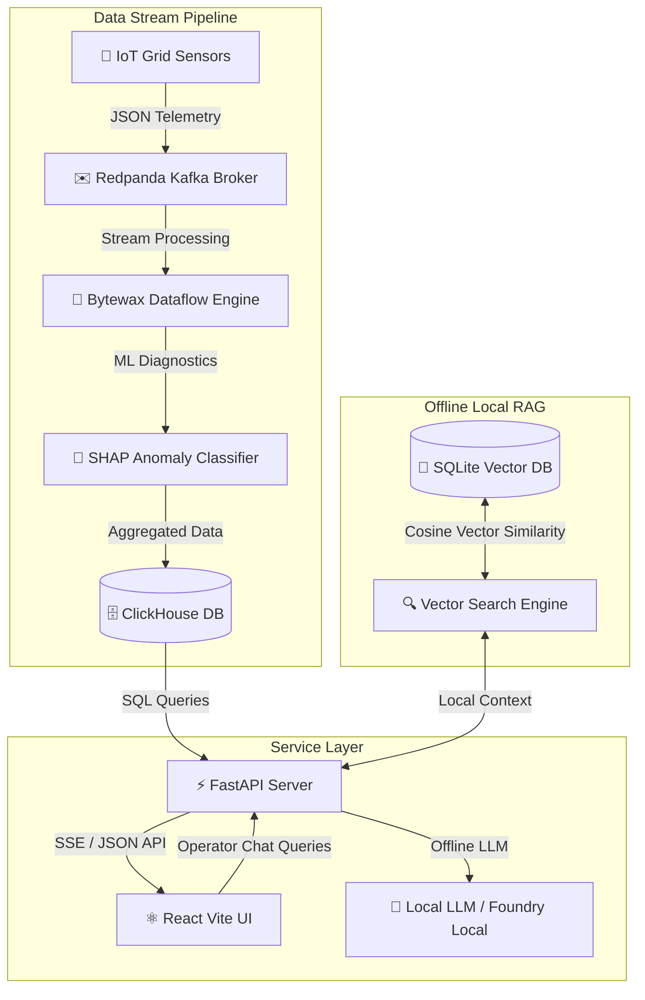

# GridPulseAI ⚡
### Microsoft Internship Project - Real-Time AI-SCADA IoT Cable Grid Monitor

**GridPulseAI** is a futuristic, enterprise-grade AI-powered Co-SCADA (Supervisory Control and Data Acquisition) monitoring dashboard. It is designed to track underground high-voltage power cables, analyze soil thermal capacity, calculate solar-induced derating limits, perform real-time explainable cybersecurity anomaly detection (XAI SHAP), and implement an offline local RAG AI Copilot using SQLite vector storage and Microsoft Foundry Local standards.

---

## 🚀 Key Features

*   **🗺️ Geographic SCADA Map (Google Maps Integration):** 
    *   Leverages high-speed Google Maps Roadmap CDN layers to load instantly.
    *   Interactive **SVG Cable Routes** (Polylines) across 9 key locations in London, changing color dynamically based on real-time cable thermal stress.
*   **📡 Stateful Big Data Stream Pipeline:**
    *   **Redpanda (Kafka):** High-throughput event ingestion broker.
    *   **Bytewax (Rust-powered):** Stateful stream processing engine grouping and filtering raw sensor telemetries.
    *   **ClickHouse OLAP Database:** Columnar database for high-performance sub-millisecond telemetry analytics.
*   **🧠 Explainable AI (XAI SHAP) & Diagnostics:**
    *   Neural threat detection identifying voltage anomalies, physical overload, and overheating alerts.
    *   Real-time **SHAP feature importance bars** displaying the AI's exact trigger factors (Load, Temp, Voltage Delta).
*   **📁 Offline Local RAG & Vector Search (SQLite & Microsoft Foundry Local):**
    *   **SQLite Vector Storage:** Stores smart grid rules, safety guidelines, and emergency protocols along with their computed embedding vectors in a local `grid_rules_kb.db`.
    *   **Local Semantic Search:** Performs cosine similarity calculations entirely offline in Python to retrieve relevant operating manuals.
    *   **Microsoft Foundry Local Integration:** Feeds retrieved context into an on-device local LLM (e.g. Phi-3.5) with graceful cloud fallbacks for fully offline, grounded Q&A.
*   **⚡ Remote SCADA Cyber Control Overrides:**
    *   Context-aware control operations (❄️ Activate Grid Cooling, 🔄 Balance Grid Phases, ⚡ Derate Current Limits) to mitigate active grid alarms.
*   **⚛️ Enlarged AI Copilot Popover & Quick Queries:**
    *   Features an expanded chat window with one-click **Quick RAG Queries** (⚡ Trafo Aşırı Yük, 🔥 Şarj Cihazı Isınma, 🔌 Voltaj Limitleri, 🍃 Yeşil Güç & Karbon) to demonstrate local vector retrieval immediately.

---

## 🏗️ System Architecture



---

## ⚙️ Tech Stack

*   **Frontend:** React 18, Vite, Leaflet, Recharts.
*   **Backend:** FastAPI (Python), Uvicorn.
*   **Data Processing:** Bytewax (Stateful Python/Rust Engine).
*   **Message Broker:** Redpanda (Kafka compatible).
*   **Database:** ClickHouse (OLAP), SQLite (Vektör Bilgi Bankası), Dragonfly (Redis-compatible cache).
*   **AI/ML:** scikit-learn, SHAP explainers.

---

## 🛠️ Setup & Execution Guide

### Prerequisites
Make sure you have the following installed on your machine:
*   [Python 3.9+](https://www.python.org/downloads/)
*   [Node.js (v16+)](https://nodejs.org/)
*   [Docker Desktop](https://www.docker.com/products/docker-desktop/)

---

### Step 1: Start Docker Infrastructure
Spin up Redpanda, ClickHouse, and Dragonfly databases in background containers:
```bash
docker compose up -d
```
Once started, the management interfaces will be available:
*   **Redpanda Console:** [http://localhost:8080](http://localhost:8080)
*   **ClickHouse Play HTTP Client:** [http://localhost:8123/play](http://localhost:8123/play)

---

### Step 2: Set Up Backend Virtual Environment
Navigate to the root directory and install dependencies:
```bash
# Create venv
python -m venv venv

# Activate venv (Windows)
venv\Scripts\activate

# Install dependencies
pip install -r requirements.txt
```

---

### Step 3: Populate local RAG Vektör Bilgi Bankası (SQLite)
Initialize the local SQLite database and populate it with smart grid safety rules and computed embeddings:
```bash
python src/initialize_kb.py
```

---

### Step 4: Run Background Services
Activate your virtual environment and start each script in a separate terminal:
1.  **FastAPI REST/SSE Server:**
    ```bash
    uvicorn src.api:app --reload --port 8000
    ```
2.  **IoT Grid Telemetry Producer:**
    ```bash
    python src/iot_grid_stream.py
    ```
3.  **Real-Time ML Anomaly Detector:**
    ```bash
    python src/grid_anomaly_detector.py
    ```

---

### Step 5: Run Frontend Client
Navigate to the `frontend/` directory, install packages, and boot Vite dev server:
```bash
cd frontend
npm install
npm run dev
```
Open [http://localhost:5173](http://localhost:5173) in your browser.

---

## 🛡️ Presentation Credentials & Notes
*   **AI Copilot (RAG):** Click the blue chat bubble at the bottom right. Click any of the **Quick RAG Queries** (e.g. ⚡ Trafo Aşırı Yük) to trigger local SQLite vector search. You will see the matching rule title prepended to the reply (e.g. `[Lokal Bilgi Bankası (RAG) eşleşmesi: Rule 101]`).
*   **Offline Mode:** If Docker is not running, the frontend automatically falls back to an offline simulated stream. You can still present the entire project without any databases running!
