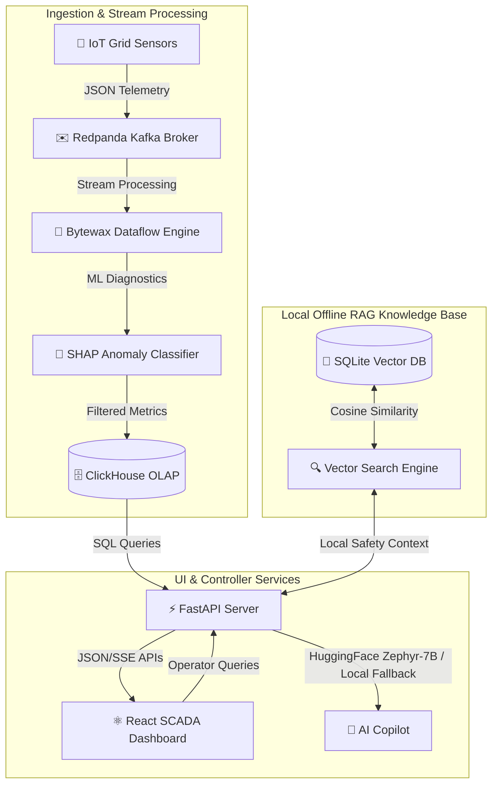

# GridPulseAI: System Architecture & Data Pipelines 🏗️

This document outlines the real-time stream processing, explainable AI, and local offline Retrieval-Augmented Generation (RAG) architecture powering the GridPulseAI SCADA dashboard.

---

## 🗺️ Architectural Block Diagram

The system consists of three distinct pipelines working together in real-time to monitor the power grid:

---

## 📡 1. Real-Time Telemetry & Big Data Pipeline

*   **IoT Grid Simulator (`src/iot_grid_stream.py`):**
    Simulates high-voltage cable metrics (Active Load, Phase Voltage, Substation Temperature) across 9 UK cities and publishes them as a constant JSON event stream to the `social_media_posts` topic in Redpanda.
*   **Redpanda Message Broker:**
    A high-throughput, Kafka-compatible event store that queues incoming telemetry events with sub-millisecond latency.
*   **Bytewax Stateful Processor (`src/grid_anomaly_detector.py`):**
    A Rust-backed Python stream processing framework that consumes the telemetry, filters anomalies based on safety limits, runs XGBoost ML inference to calculate stability probability scores, and executes SHAP explainers to diagnose feature weights.
*   **ClickHouse OLAP Database:**
    Stores aggregated diagnostics and anomaly records in the `bot_alerts` table, enabling instantaneous read queries from the FastAPI server.

---

## 🧠 2. Offline Retrieval-Augmented Generation (RAG) Pipeline

*   **Local Knowledge Store (`data/grid_rules_kb.db`):**
    A local SQLite database containing official operating rules (e.g. Transformer Limits, Phase Voltage Balances, EV Thermal Overloads) initialized by `src/initialize_kb.py`.
*   **Cosine Similarity Search Engine (`src/vector_store.py`):**
    Implements a zero-dependency, local TF-IDF style vectorizer and cosine similarity function. It converts user queries to frequency vectors and compares them against the stored rules in SQLite to pull the top matching documents entirely offline.
*   **AI Copilot Integration (`src/api.py` & `src/prompt_builder.py`):**
    Injects the matching SQLite rules and active ClickHouse anomalies directly into the system context, grounding the Large Language Model and preventing hallucination.

---

## ⚛️ 3. Web SCADA Presentation Layer

*   **FastAPI backend server (`src/api.py`):**
    Exposes REST/POST endpoints for manual anomaly injection, historical query execution, remote control overrides (Cooling activation, Phase balancer), `/api/vectorize` metadatas, `/api/vector_compare` similarities, and the `/api/copilot` LLM chatbot.
*   **Vite/React UI (`frontend/src/App.jsx`):**
    A dynamic dark-mode SCADA console containing:
    1.  **🧠 Yapay Zeka Beyni (AI Brain Control Room) Tab:** A full-screen operations workspace displaying a large chat terminal side-by-side with active system variables (ClickHouse logs, SQLite rules count, weather scales) that the AI reads in real-time.
    2.  **🔍 RAG Akış Analizi (RAG Execution Path Inspector) Modal:** A step-by-step diagnostic modal that visualizes the query vector, SQLite cosine similarity matches, ClickHouse anomalies context, and the raw system prompt payload.
    3.  **🧪 Vektör & Kosinüs Matematik Simülatörü (Vector Cosine Math Lab):** A playground allowing operators to vectorize arbitrary words and compare sentences using Cosine Similarity metrics.
    4.  **🟢 Glowing Service Health LEDs:** A status checker panel in the topbar polling the server status endpoint to confirm database connectivity.
    5.  **🗺️ Interactive Geographical Map:** Visualizes cables dynamically colored by thermal stress.
    6.  **📈 SHAP Feature Importance Bars:** Explainable AI charts explaining the neural model classification.
